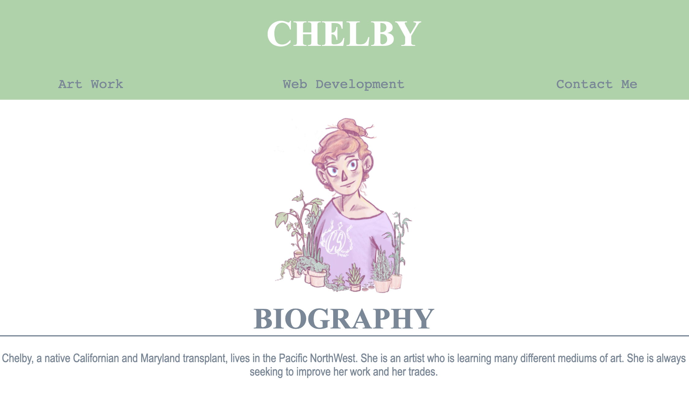

# <Responsive-Portfolio-Page>
## Description
I made this portfolio page to show what I've learned in css and html thusfar in my development learning. I struggled with many things like positioning and getting things to be reactive when sizing up and down the page, I still thihnk there are some thing I can improve, but I will come back to this project later. I learned a little bit more how to go about reading documentation and implementing it into my own code, especially for topics that aren't taught in class specifically. This is not only something I can use later on as a reference when I make a real portfolio page for my development work, but also something I can refer to for extra practice here and there. 


## Acceptance Criteria

```
GIVEN I need to sample a potential employee's previous work
WHEN I load their portfolio
THEN I am presented with the developer's name, a recent photo or avatar, and links to sections about them, their work, and how to contact them 
WHEN I click one of the links in the navigation
THEN the UI scrolls to the corresponding section 
WHEN I click on the link to the section about their work
THEN the UI scrolls to a section with titled images of the developer's applications
WHEN I am presented with the developer's first application
THEN that application's image should be larger in size than the others
 WHEN I click on the images of the applications
THEN I am taken to that deployed application
WHEN I resize the page or view the site on various screens and devices
THEN I am presented with a responsive layout that adapts to my viewport
```

## Mock-Up

The following animation shows an example given for appearance and functionality:


My Version: 


- - -

## License
© 2021 Trilogy Education Services, LLC, a 2U, Inc. brand. Confidential and Proprietary. All Rights Reserved.
